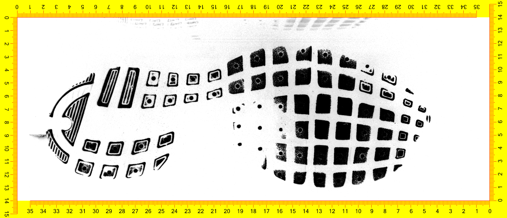
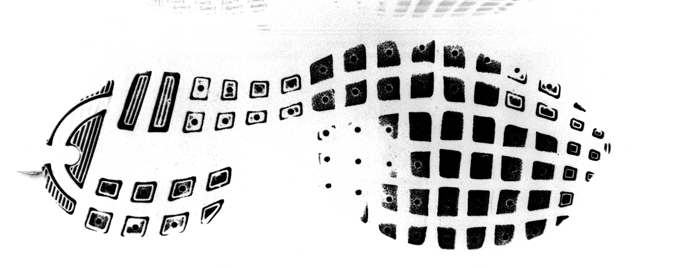
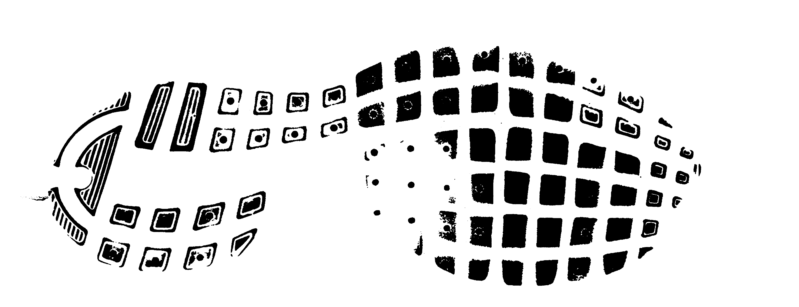
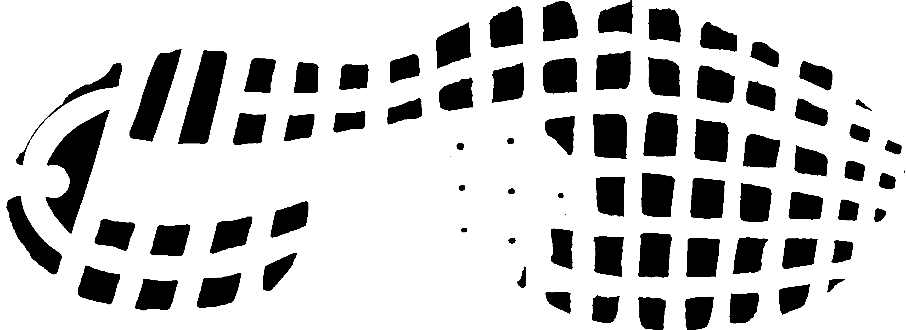
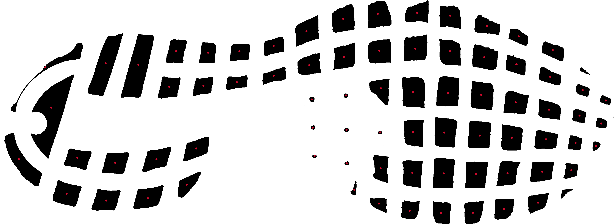
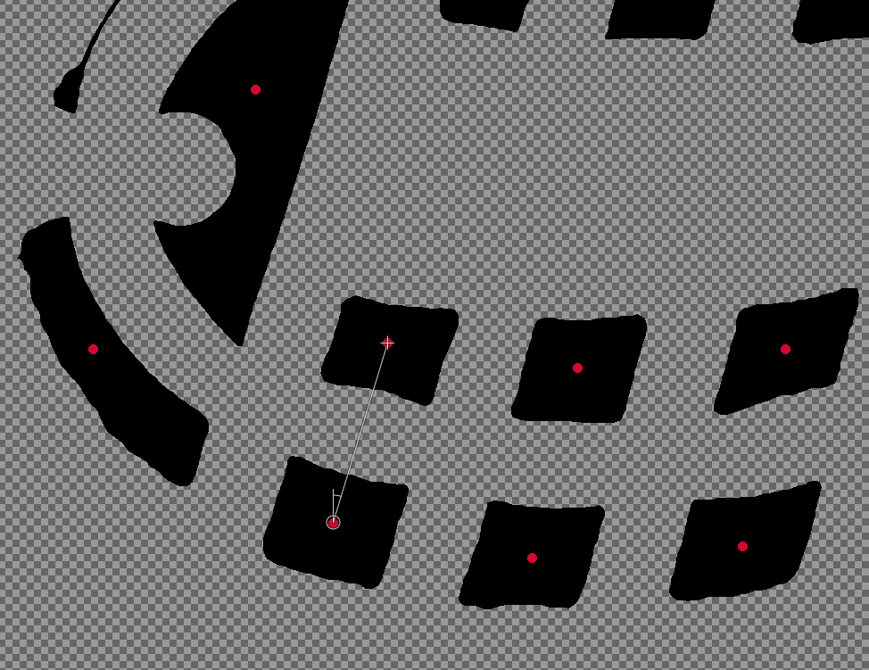

```{r setup, include=FALSE}
knitr::opts_chunk$set(echo = F, dpi = 300, cache = T)

library(imager)
library(tidyverse)
```


This is a demonstration of how the process might work by hand. 

## Basic Steps, Illustrated



### Crop out ruler



### Filter out background noise



### Clean up the image



### Separate regions and identify the centers



### Measure distance from point to point to create a mesh



Measurement is obviously trickier but I used the ruler tool in GiMP to show the process. 


## Basic Algorithm for ECCO shoes

```{r, message = F, warning = F}

ims <- list.files("../data/ECCO/", "*.tiff", full.names = T)[c(1, 6, 11, 16)] %>% 
  purrr::map(load.image) %>%
  purrr::map(imrotate, angle = 90) %>%
  as.imlist

plot(ims)
```

### Crop and Filter

```{r, echo = T}

# Remove EverOS ruler
crop_everos <- function(im) {
  # Cut out yellow/red area
  img_bbox <- im %>%
    imsplit(axis = "c") %>%
    (function(x) is.finite((x[[1]] + x[[2]])/x[[3]])) %>%
    as.cimg() %>%
    (function(x) x == 1)
  
  crop.bbox(im, img_bbox) %>%
    # convert to grayscale
    grayscale() %>%
    # Autocrop each half of the image
    ImageAlignR::map_halfimg(fun = autocrop) %>%
    # Crop 5px from each side to clean residual bits up
    crop.borders(nx = 5, ny = 5) %>%
    # Crop out extra white space
    autocrop() %>%
    # Convert to black and white
    threshold() %>%
    # Clean up fuzz (at most 3x3 px)
    shrink(3) %>%
    grow(3) %>%
    # Crop again
    autocrop()}

```

```{r}
im_clean <- ims %>%
  purrr::map(crop_everos) %>%
  as.imlist()


plot(im_clean)
```


### Clean Image

Cleaning the image requires that we have a minimum "interesting" size and shape - this is used to define a filter. Many of these filters work better on an inverted image.

Measuring the dots in the ECCO shoes in an image editing program, we can see that the small dots are ~ 25 px across. Our filter, thus, is a circular matrix with radius 10 pixels - smaller than the small dots we want to keep. 

```{r}

# Convenience function to reverse b/w in an image
invert_im <- function(im) {
  1 - im
}

small_cir <- px.circle(r = 10)
plot(small_cir, main = "Filter used to clean the image")

clean_image <- function(im, radius = 10) {
  cir <- px.circle(radius)
  
  im %>% 
    invert_im()  %>%
    dilate(cir) %>% 
    erode(cir) %>% 
    invert_im() %>%
    dilate(cir) %>%
    erode(cir)
}

im_clean2 <- im_clean %>%
  purrr::map(clean_image) %>%
  as.imlist()

plot(im_clean2)
```
### Check basic shape statistics

```{r, cache = F}

# compute some basic statistics about length, width, and pct of bounding box filled
shape_stats <- function(px) {
  df <- as.data.frame(px)
  df %>%
    summarize(npx = n(), 
              xmed = median(x),
              ymed = median(y),
              xspan = diff(range(x)), 
              yspan = diff(range(y)),
              bbox = xspan*yspan, 
              pct_bbox = npx/bbox, pxdf = list(df), px = list(px))
}

keep_circles <- function(im) {
  # For each region, compute some basic image statistics to help determine if 
  # it's the right size and/or shape
  tmp <- label(im) %>% split_connected() %>% map_df(shape_stats) %>%
    mutate(suspect = pct_bbox < .7 | xspan > 130 | yspan > 130)
  # This depends on knowing that the largest circles are ~ 100 px in diameter
  
  remove_sm <- filter(tmp, suspect)$px %>% parany
  im_new <- (invert_im(im) - remove_sm) %>%
    invert_im()
  
  tibble(data = list(tmp), im = list(im_new))
}

# Have to work only on the smaller data set 
im_circles <- im_clean2 %>% 
  map_df(keep_circles) 
im_circles$im <- as.imlist(im_circles$im)

plot(im_circles$im)
```

This portion of the algorithm explicitly depends on the size and shape of the dominant feature in the shoe. It would have to be modified to work with e.g. hexagons or rectangles, and would still only work for a regular pattern of the same shape.

As part of the shape filtering, we calculate the center (median) of each shape. This obviously doesn't work properly for concave shapes, but for circles it is just fine. 

### Create mesh from centers

```{r, cache = F}
points <- im_circles %>%
  mutate(shoe = c(1, 6, 11, 16)) %>%
  select(-im) %>%
  unnest(data)
```

```{r}
library(tripack)

mesh <- points %>% 
  select(shoe, x = xmed, y = ymed) %>% 
  nest(data = -shoe) %>%
  mutate(tri = purrr::map(data, tri.mesh))

par(mfrow = c(2, 2))
walk(mesh$tri, plot.tri)
```


## Results using the ECCO parameters on other shoes

If we use the same set of steps to clean other shoes, however, this doesn't work nearly as well - the filter, which is customized to handle specific pattern elements in the ECCO shoes (and a specific size/resolution of scan image) do not generalize well. 

Here, the 5 pictures show the 5 steps: 

1. Original
2. Cropping
3. Cleaning using circle filter
4. Remove non-circular-ish shapes
5. Final image

```{r, include = F, eval = F}
shoe_regions <- function(im, radius=10) {
  res_steps <- imlist(orig = im)
  
  res_steps$cropped <- crop_everos(im)
  
  # large structuring element
  cir <- px.circle(radius)
  
  # Try cleaning by cir at first
  res_steps$clean_sm <- res_steps$cropped %>% 
    invert_im()  %>%
    dilate(cir) %>% 
    erode(cir) %>% 
    invert_im() %>%
    dilate(cir) %>%
    erode(cir)
  
  # For each region, compute some basic image statistics to help determine if 
  # it's the right size and/or shape
  tmp <- label(res_steps$clean_sm) %>% split_connected() %>% map_df(shape_stats) %>%
    mutate(suspect = pct_bbox < .7 | xspan > 130 | yspan > 130)
  
  res_steps$remove_sm <- filter(tmp, suspect)$px %>% parany
  
  res_steps$result <- (invert_im(res_steps$clean_sm) - res_steps$remove_sm) %>%
    invert_im()
  
  mesh <- tri.mesh(tmp$xmed, tmp$ymed)
  
  # could compute some similar stats for the large version
  return(list(steps = res_steps, region_info = tmp, mesh = mesh))
}

```


```{r, include = F, eval = F}
files <- list.files("../data/OtherPatterns/", "*.tiff", full.names = T)

ims <- map(files, load.image) %>%
  map(imrotate, angle = 90) %>% 
  as.imlist()
res <- map(ims, shoe_regions)

res_df <- tibble(
  image = ims, 
  steps = purrr::map(res, "steps"), 
  region = purrr::map(res, "region_info"),
  mesh = purrr::map(res, "mesh"), 
  name = paste0("images/example", 1:length(files), "_results.png"))

plot_shoe_res <- function(res, name) {
  png(name, width = 5000, height = 15000, units = "px")
  plot(res, layout = "col")
  dev.off()
}

purrr::walk2(res_df$steps, res_df$name, plot_shoe_res)
```

Squares | Sketchers w/ dots and text | Nike Winflo
------- | ------- | -------
 |  | 


Squares 2 | Teva triangles | Dots + Crosses
------- | ------- | -------
 |  | 

This exercise produces 2 major insights: 

1. The ECCO parameters are far from universal
2. The gray backgrounds occur because I haven't handled "islands" within black areas that are big enough to escape cleaning. I should probably handle that better in future code.
